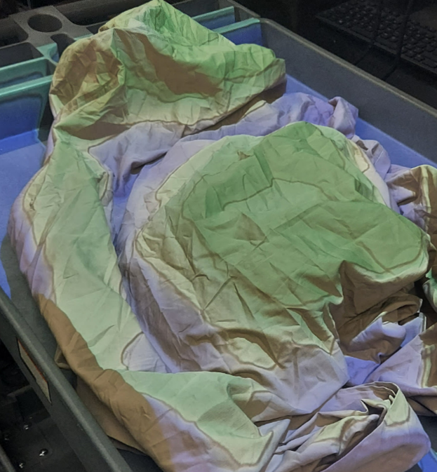

# Topographic Sand Map

A program that generates a real time topographic map using the Xbox Kinect sensor. Using shaders and an alignment script, this program reads data from the depth sensor and creates a map in real-time that can be projected onto the surface. The intent of this is to have a sandbox where people can create mountains, lakes, beaches, etc.

Features:
- Alignment control system
- Different color mappings (including textures)
- Visual customizations
- Contour lines

Example photo:

## Description
This project interfaces with Microsofts Kinect API to read depth data from the Kinect Sensor. It then processes the frames through a blurring and TAA filter using a computer shader, and then passes it to a pixel shader which converts the processed depth data into the visual map result. The entire project is written in C# and HLSL and uses Unity. The project also features an alignment menu that can be used to assist in setup.

## Usage
The installation guide can be read here: [Unity Topo Sand Map Installation](Unity.md).
If you would like to print out a usage guide, a template can be found here: [Usage template](https://docs.google.com/document/d/1PeV7TJXtiisWk1MjWxcuHAWilxO1KAcwr_s8edOt2D0/edit?usp=sharing).

## Credits
This project was created by [Benjamin Cates](https://github.com/benjamin-cates) at the [Friday Night Lab](https://www.fnlhub.com/) at College of the Sequoias during the Fall 2022 semester.

